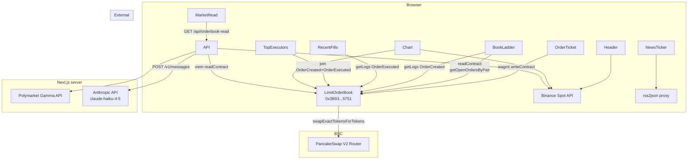

# ChainDesk — Architecture Reference

A deeper cut than [`TECHNICAL.md`](./TECHNICAL.md), aimed at a judge or contributor who wants to understand the system module-by-module without running it. For how to run it, read [`TECHNICAL.md`](./TECHNICAL.md). For why it exists, read [`PROJECT.md`](./PROJECT.md).

---

## 1. Repository layout

```
chaindesk/
├── README.md                   # Project overview + docs index
├── bsc.address                 # JSON record of deployed contract + router + pair
├── foundry.toml                # Foundry config
├── remappings.txt              # OZ + forge-std import remappings
│
├── src/
│   └── LimitOrderBook.sol      # The whole protocol (~200 LOC)
│
├── script/
│   └── Deploy.s.sol            # Forge deploy script (reads router from .env)
│
├── test/
│   └── LimitOrderBook.t.sol    # Foundry unit + invariant tests
│
├── docs/
│   ├── PROJECT.md              # Problem, solution, impact, roadmap
│   ├── TECHNICAL.md            # Architecture, setup, demo guide
│   ├── ARCHITECTURE.md         # (this file) module-level deep dive
│   └── EXTRAS.md               # Optional video + slides
│
└── web/                        # Next.js 14 terminal frontend
    ├── app/
    │   ├── layout.tsx          # Root layout, font loading
    │   ├── page.tsx            # Full Bloomberg dashboard composition
    │   ├── providers.tsx       # React Query + wagmi + RainbowKit boot
    │   ├── ClientProviders.tsx # "use client" wrapper for providers.tsx
    │   ├── globals.css         # Tailwind base + keyframes (flash, marquee, tick)
    │   └── api/
    │       └── orderbook-read/
    │           └── route.ts    # Server route: Claude Haiku synthesis
    ├── components/             # All visual modules (see §7)
    ├── hooks/                  # All data-fetching hooks (see §8)
    ├── lib/
    │   ├── abi.ts              # LimitOrderBook + ERC20 + WBNB + Router ABIs
    │   ├── binance.ts          # Binance REST client (klines, ticker)
    │   ├── book.ts             # Order → BookLevel aggregation + isCrossable
    │   ├── constants.ts        # Addresses, chain IDs, polling intervals
    │   ├── price.ts            # Price math, formatting, short-address helper
    │   └── wagmi.ts            # wagmi config (BSC testnet + WC project id)
    ├── tailwind.config.ts      # Bloomberg palette + zero-radius overrides
    ├── next.config.js          # reactStrictMode: false (RainbowKit quirk)
    └── package.json            # Pinned versions (see §2)
```

**One-sentence summary of each top-level directory:**

| Path | Owns |
|---|---|
| `src/` | The canonical orderbook — everyone else reads from this |
| `script/` | Foundry deploy automation |
| `test/` | Solidity tests (run via `forge test`) |
| `docs/` | Everything the judge needs to read before running |
| `web/app/` | Next.js routes + server route for the Claude Market Read |
| `web/components/` | React components, one file = one visual module |
| `web/hooks/` | All onchain + external data fetching, behind React Query |
| `web/lib/` | Pure helpers — no React, no side effects |

---

## 2. Stack

### Contract

| Piece | Version | Purpose |
|---|---|---|
| Solidity | 0.8.20 | Language (safe math by default) |
| Foundry | latest | Build, test, deploy |
| `@openzeppelin/contracts` | latest stable | `SafeERC20`, `ReentrancyGuard`, `IERC20` |
| `forge-std` | latest | Test helpers (`Test`, `console`) |
| PancakeSwap V2 Router | `0xD99D1c3…550D1` (testnet) | Settlement AMM (injected via constructor) |

### Frontend

| Piece | Version | Role |
|---|---|---|
| Next.js | `14.2.15` | App Router, server actions, API routes |
| React | `18.x` | UI runtime |
| TypeScript | `5.x` | Strict types end-to-end |
| Tailwind CSS | `3.x` | Styling (Bloomberg palette in `tailwind.config.ts`) |
| wagmi | `2.12` | Wallet + chain IO React bindings |
| viem | `2.21` | Low-level EVM client (used by wagmi + server route) |
| RainbowKit | `2.2.10` | Connect-wallet UI |
| `@tanstack/react-query` | `5.99` | Caching / polling layer under wagmi + custom hooks |
| lightweight-charts | `4.x` | Native candle chart |
| TradingView embed (`tv.js`) | — | Optional chart mode (`NATIVE \| TV` toggle) |
| rss2json (public proxy) | — | CORS-friendly RSS aggregation for the news ticker |
| Anthropic API | `claude-haiku-4-5-20251001` | Market Read synthesis |

### External data sources

| Source | Used by | Call signature |
|---|---|---|
| BSC Testnet RPC (`bsc-testnet.publicnode.com`) | `useOpenOrders`, `useRecentFills`, `useStats`, `useExecutors`, `useOrderTxHashes`, `useBlockInfo` | viem `getLogs`, `readContract`, `getBlockNumber` |
| Binance Spot (`api.binance.com`) | `useTicker`, `useRefPrice`, `app/api/orderbook-read` | `/api/v3/ticker/24hr`, `/api/v3/klines` |
| Polymarket (`gamma-api.polymarket.com`) | `app/api/orderbook-read` | `/markets?closed=false&order=volume24hr&tag_slug=crypto` |
| Anthropic (`api.anthropic.com`) | `app/api/orderbook-read` | `POST /v1/messages` |
| rss2json (`api.rss2json.com`) | `useNews` | Proxies Cointelegraph, CoinDesk, Decrypt RSS |

---

## 3. Contract storage layout

From `src/LimitOrderBook.sol`:

```solidity
struct Order {
    address maker;          // slot 0 (packed)
    uint64  deadline;       // slot 0 (packed)
    bool    active;         // slot 0 (packed)
    address tokenIn;        // slot 1
    address tokenOut;       // slot 2
    uint256 amountIn;       // slot 3
    uint256 minAmountOut;   // slot 4
}

IPancakeRouter02 public immutable router;   // constructor-fixed
uint256 public nextOrderId;                  // auto-increment
mapping(uint256 => Order) public orders;    // orderId → Order

mapping(address => uint256[]) private _ordersByMaker; // maker → [orderId]
mapping(bytes32 => uint256[]) private _ordersByPair;  // keccak(tokenIn, tokenOut) → [orderId]
```

**Packing:** `maker` (20) + `deadline` (8) + `active` (1) = 29 bytes, fits in slot 0 with 3 bytes padding. Saves one SSTORE on every `createOrder`.

**Index mappings:** not strictly necessary for correctness — the contract could rebuild them from events — but caching them on-chain means the frontend can render the public book with pure `eth_call` (no log scan, no indexer). `getOpenOrdersByPair(tokenIn, tokenOut)` walks `_ordersByPair[keccak256(tokenIn, tokenOut)]` and filters by `active && deadline > block.timestamp` in two passes.

**Limit price:** intentionally not stored. It's implicit in `minAmountOut / amountIn`, so "edit price" = "cancel + recreate." Keeps storage small and prevents stale-price attacks.

---

## 4. Public ABI

### Mutating functions

| Signature | Access | Emits |
|---|---|---|
| `createOrder(address tokenIn, address tokenOut, uint256 amountIn, uint256 minAmountOut, uint64 deadline) → uint256 orderId` | anyone | `OrderCreated` |
| `cancelOrder(uint256 orderId)` | maker only | `OrderCancelled` |
| `executeOrder(uint256 orderId, address[] calldata path)` | anyone | `OrderExecuted` |

### View functions

| Signature | Returns |
|---|---|
| `orders(uint256 orderId)` | the raw `Order` struct |
| `getOpenOrdersByPair(address tokenIn, address tokenOut)` | `(uint256[] activeIds, Order[] activeOrders)` — filtered active + unexpired |
| `getOrdersByMaker(address maker)` | `(uint256[] ids, Order[] makerOrders)` — full history for that maker |
| `nextOrderId()` | total orders ever created |
| `router()` | PancakeSwap V2 router address (immutable) |

### Custom errors

| Error | Raised when |
|---|---|
| `NotMaker()` | `cancelOrder` called by non-maker |
| `OrderNotActive()` | `cancelOrder` or `executeOrder` on inactive order |
| `OrderExpired()` | deadline ≤ `block.timestamp` |
| `InvalidAmount()` | `amountIn == 0` or `minAmountOut == 0` |
| `InvalidPair()` | `tokenIn == tokenOut` or either is `address(0)` |
| `InvalidPath()` | `path` length < 2, or endpoints don't match order's `tokenIn`/`tokenOut` |
| `InsufficientOutput()` | post-swap balance delta < `minAmountOut` (should be unreachable — router would revert first, kept as defense-in-depth) |

---

## 5. Event schemas

All three events are what the frontend subscribes to; every piece of historical analytics reads these.

### `OrderCreated`

```solidity
event OrderCreated(
    uint256 indexed orderId,   // topic 1
    address indexed maker,     // topic 2
    address indexed tokenIn,   // topic 3
    address         tokenOut,  // data
    uint256         amountIn,  // data
    uint256         minAmountOut,
    uint64          deadline
);
```

- **Indexed:** `orderId`, `maker`, `tokenIn` — makes filtering by user or by pair cheap in `eth_getLogs`.
- **Used by:** `useStats` (volume denomination), `useOrderTxHashes` (to map orderId → creation tx hash), `MarketRead` route (to build the synthesis prompt).

### `OrderCancelled`

```solidity
event OrderCancelled(
    uint256 indexed orderId,
    address indexed maker
);
```

Minimal. The maker can always rebuild the Order struct by orderId if they need to.

### `OrderExecuted`

```solidity
event OrderExecuted(
    uint256 indexed orderId,   // topic 1
    address indexed executor,  // topic 2
    uint256         amountOut, // data — what the AMM returned (≥ minAmountOut)
    uint256         executorTip // data — amountOut - minAmountOut, the executor's take
);
```

- **Why emit both `amountOut` and `executorTip`:** the maker's fill price is derivable from `amountOut - executorTip`, and the two together let us reconstruct MEV without querying the contract again.
- **Used by:** `useRecentFills`, `useStats`, `useExecutors`.

---

## 6. Server route schema — `POST /api/orderbook-read`

Despite the route being a GET, its semantics are "synthesize one read." Idempotent and cacheable.

### Request

`GET /api/orderbook-read` — no body, no query parameters. Poll cadence is client-side (30 seconds, set in `components/MarketRead.tsx`).

### Response

```ts
type MarketReadResponse = {
  read: string;           // the 3-4 sentence Bloomberg-voice synthesis
  updatedAt: number;      // unix seconds
  sources: {
    orderbook: number;               // # of open orders used in the prompt
    predictionMarkets: string[];     // Polymarket market questions used
    spotPrice: number;               // Binance BNBUSDT 1m close
  };
};
```

### Error response

```ts
type MarketReadError = {
  error: string;   // human-readable cause, e.g. "anthropic 401: ..."
};
```

HTTP code is `500` for configuration issues, `502` for upstream failures. When `ANTHROPIC_API_KEY` is absent, the route falls back to a **data-driven demo read** built from real orderbook imbalance + spot + top Polymarket market (see `buildDemoRead` in `route.ts`) and still returns `200 OK` — so the UI is always narrative-populated.

### Claude API payload (internal)

```json
{
  "model": "claude-haiku-4-5-20251001",
  "max_tokens": 200,
  "system": "<SYSTEM_PROMPT — see route.ts>",
  "messages": [
    { "role": "user", "content": "PAIR: WBNB/BUSD\nSPOT: $...\n\nONCHAIN ORDERBOOK (open limit orders):\n- $X | Y WBNB | buy|sell | 0xabcd...\n\nPREDICTION MARKETS (top by volume):\n- \"Question\" — YES: X%, NO: Y%, 24h vol: $Z\n\nProduce the market read now." }
  ]
}
```

Capped at 20 orders and 5 prediction markets in the prompt to keep tokens predictable.

---

## 7. Frontend component map

Every file under `web/components/` is a single-purpose visual module. The ones that matter for judging:

| Component | Renders | Primary data source |
|---|---|---|
| `Header.tsx` | Bloomberg top bar (symbol, LAST/BID/ASK, 24h stats, UTC session clock, price flashes) | `useTicker` |
| `NewsTicker.tsx` | CSS-marquee scrolling crypto headlines | `useNews` |
| `StatsBar.tsx` | Volume / tips / fills / executors / live orders | `useStats` |
| `SignalsStrip.tsx` | Book imbalance %, spread, whale detection | `useSignals` |
| `MarketRead.tsx` | **Full-width AI synthesis banner (the differentiator)** | `GET /api/orderbook-read` |
| `BookLadder.tsx` | Public order book with expandable per-order tx links + "⚡ Execute All Crossable" | `useOpenOrders`, `useOrderTxHashes`, `useRefPrice` |
| `MyOrders.tsx` | The user's open + historical orders | `useMyOrders` |
| `FillsTabs.tsx` | Tab switcher for `RecentFills` ↔ `TopExecutors` | — |
| `RecentFills.tsx` | Chronological fills with BscScan tx links | `useRecentFills` |
| `TopExecutors.tsx` | Leaderboard of MEV actors by tip value | `useExecutors` |
| `Chart.tsx` | Native lightweight-charts candle view with resting-order overlays + fill markers | `useTicker`, `useOpenOrders`, `useRecentFills` |
| `TradingViewChart.tsx` | Optional TradingView embed | `tv.js` widget |
| `OrderTicket.tsx` | Maker ticket with spot-price autofill + digit-only sanitization | `useAllowance`, `useBalance`, `useRefPrice` |
| `WrapHelper.tsx` | BNB → WBNB wrap/unwrap helper | `wbnbAbi` direct calls |
| `GetBusd.tsx` | Testnet faucet helper for BUSD | hardcoded mint |
| `StatusFooter.tsx` | Chain status, block number (pulsing), RPC latency, F-key hints with letter fallbacks | `useBlockInfo` |
| `HelpModal.tsx` | `?`/`H` key opens TL;DR of the mechanism | — |

---

## 8. Hook responsibilities

One-line summary of every file under `web/hooks/`:

| Hook | What it returns | Source |
|---|---|---|
| `useOpenOrders` | All active orders across both directions of BASE/QUOTE | `getOpenOrdersByPair` (both directions), polled 3s |
| `useMyOrders` | All orders for the connected wallet | `getOrdersByMaker`, polled 3s |
| `useRecentFills` | Last N `OrderExecuted` logs with tx hash | `getLogs` over 200k blocks |
| `useStats` | Volume + tips (USD), fill/executor counts, live orders | `OrderCreated` + `OrderExecuted` join |
| `useExecutors` | Executor leaderboard sorted by cumulative tip USD | same logs as `useStats`, grouped by executor |
| `useOrderTxHashes` | `orderId → txHash` map for tracing | `OrderCreated` logs, refresh 15s |
| `useBlockInfo` | Latest block number + RPC latency | `getBlockNumber`, polled 2s with `Date.now()` delta |
| `useTicker` | Binance 24h ticker (last/high/low/volume) | `api.binance.com/api/v3/ticker/24hr` |
| `useRefPrice` | Current spot from latest 1m candle | `api.binance.com/api/v3/klines?interval=1m&limit=1` |
| `useSignals` | Book imbalance %, spread %, whale flag | derives from `useOpenOrders` |
| `useAllowance` / `useBalance` | ERC20 allowance + balance for the ticket | `erc20Abi` reads |
| `useNews` | 15 most recent headlines across 3 RSS feeds | `api.rss2json.com` |

All hooks use `@tanstack/react-query` under the hood (directly, or via wagmi). There is no global Redux / Zustand store — component state is local, server state is queried.

---

## 9. End-to-end data flow



---

## 10. What lives off-chain vs on-chain (and why)

| Concern | On-chain | Off-chain | Reasoning |
|---|---|---|---|
| Order state | ✅ | — | The whole point — it must be public and tamper-proof |
| Maker index / pair index | ✅ | — | Lets frontend render without an indexer |
| Settlement routing | ✅ | — | Must be atomic with escrow release |
| Historical fills analytics | reconstructible from logs | computed client-side | Cheaper than maintaining a subgraph for a hackathon |
| Price reference (chart) | — | ✅ Binance | AMM mid price is noisy; Binance has granularity for good candles |
| Market Read LLM call | — | ✅ server route | Inference can't run on-chain |
| News ticker | — | ✅ RSS proxy | Flavor, not security-critical |

---

## 11. Security posture

The contract is intentionally small and reviewable end-to-end in ten minutes. Key invariants:

| Invariant | Enforced by |
|---|---|
| Only maker can cancel | `if (order.maker != msg.sender) revert NotMaker();` |
| No double-execute | `order.active = false` set *before* any external call (CEI) |
| No reentrancy | `nonReentrant` on every mutating function |
| Maker gets ≥ minAmountOut | Router rejects at its own `amountOutMin` check, plus post-swap balance-delta sanity check `InsufficientOutput()` |
| Escrow cannot be stolen by executor | Executor receives only `amountOut - minAmountOut` (the tip), never the principal |
| No admin | No `owner`, no `Ownable`, no upgradability pattern, no pause |

Known limitations (documented in `PROJECT.md §4`): no fee-on-transfer support, no partial fills, unbounded view functions, not audited.
