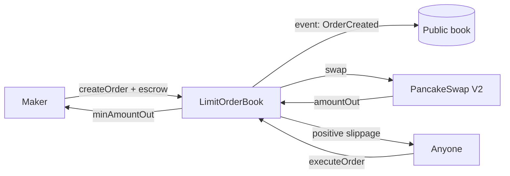

# ChainDesk — Problem, Solution & Impact

## 1. Problem

Active BSC traders can't place a plain limit order against a native AMM. PancakeSwap, ApeSwap, Biswap — all of them only support market-style `swapExactTokensForTokens`. The market in practice has filled this gap with **private keeper networks** (1inch Limit Order, CoW Protocol, etc.) that sit off-chain, intermediate order flow, and execute against the AMM when crossable.

The problem with that pattern:

- **Custody is partially off-chain.** The keeper's infrastructure decides *when* your order executes and *at what price*, within a signed range. That is a trust assumption most users never read.
- **Order state is private.** You can't see what other people want to buy or sell without paying an API for it. The orderbook is not a public good.
- **MEV is extractive.** Private keepers capture positive slippage and sell it back through opaque auctions. A retail user never sees the tip.
- **No resting-order composability.** If orders aren't on-chain, on-chain strategies (vaults, automators, LP hedgers) can't read them, can't execute against them, and can't settle in the same tx.

This matters because BSC has real volume — $300M+ daily across PancakeSwap — and the tooling around it is still organized around the "wallet + swap" mental model. Anyone building serious trading UX on BSC has to either run their own keeper or plug into a centralized one.

## 2. Solution

**ChainDesk is a permissionless public limit order book for BSC.** One contract. ~200 lines of Solidity. Anyone can create, cancel, or execute an order.

The core mechanic:

1. **Maker** calls `createOrder(tokenIn, tokenOut, amountIn, minAmountOut, deadline)`. Tokens are pulled into escrow. The implicit limit price is `minAmountOut / amountIn`.
2. **Anyone** calls `executeOrder(orderId, path)` once the AMM price has crossed. The contract routes the swap through PancakeSwap V2, pays the maker exactly their `minAmountOut`, and **pays positive slippage to the executor as a tip.**
3. That tip is the whole incentive system. No keeper network, no private mempool, no off-chain coordination. If the order is crossable, executing it is profitable — and the first person to spot it wins.

On top of that primitive, the frontend (ChainDesk Terminal) is a Bloomberg-style trading interface that consumes the public book directly:

- Live onchain order ladder with maker diversity, size, and distance-to-cross
- Chart overlays showing every resting limit order (click to prefill ticket)
- One-click "Execute All Crossable" button
- **AI Market Read** — Claude Haiku synthesizes the onchain orderbook, Binance spot reference, and top Polymarket crypto prediction markets into a 3-4 sentence Bloomberg-voice note, refreshed every 30 seconds
- Top Executors leaderboard (ranks MEV actors by cumulative tip value, because the book is public nobody can hide)

### Why this approach works

| Alternative | What it gives up |
|---|---|
| 1inch Limit Order API | Off-chain order matching, private keeper network, trust in the API |
| CoW Protocol / Matcha | Solver auction is off-chain and opaque |
| DEX aggregator swap | Not a limit order at all — market only |
| Run your own keeper | High ongoing infra + OPEX for something that should be public |

ChainDesk makes the book itself a public good. Execution economics are open. Anyone can be the keeper. There is no admin key.

**The structural win over 1inch / CoW:** a limit order that lives in an off-chain RFQ database is invisible to the next smart contract. A ChainDesk order is on-chain state — any protocol (a vault rebalancer, a liquidation engine, a cross-pair arb router) can read it with `eth_call` and execute against it in the same transaction. That is a thing private keeper networks structurally cannot offer, and it's the real reason the orderbook belongs on-chain.

## 3. Business & Ecosystem Impact

**Target users:**
- Retail BSC traders who want a real limit order without trusting a bot operator
- Onchain strategy vaults that need composable resting orders (can execute other people's orders atomically with their own logic)
- Solo MEV searchers who want a cleaner, public source of executable flow than PancakeSwap mempool snooping

**Adoption path:**
1. BSC testnet deployment for hackathon judging and public beta
2. Mainnet deployment with a seeded executor (us) so the UX is "it just works" day-1
3. Open up the executor role — anyone running the frontend can opt in to execute crossable orders
4. Integrate with existing BSC wallets (TrustWallet, Binance Wallet) as an embedded limit-order widget

**Value to the ecosystem:**
- A public orderbook primitive that other protocols can build on. Lending markets can liquidate into resting limits. Vaults can set TWAP exits as a series of limits. Portfolio rebalancers can express target allocations declaratively.
- Transparent MEV. By making executor tips visible and rankable, we create social pressure against private pipes and toward public execution.

**Sustainability:**
- v1 charges no protocol fee by design — we want adoption, not extraction.
- v2 could introduce an optional protocol fee (bps on executor tip) gated by token-holder governance. Not a hackathon concern.
- The terminal frontend is a separate product and could be monetized via a prosumer tier (real-time alerts, portfolio backtests), but the underlying book stays free and public.

## 4. Limitations & Future Work

**Current limitations:**
- No support for fee-on-transfer tokens (escrow accounting would drift). Documented in the contract NatSpec.
- Orders are all-or-nothing — no partial fills. Makes execution simpler but misses some crossable flow.
- No protocol fee on the contract itself.
- View functions (`getOpenOrdersByPair`, `getOrdersByMaker`) are unbounded and could hit out-of-gas at very high order counts per pair. Frontend paginates; contract could expose a paginated variant in v2.
- Not audited. Testnet only for submission.

**Near-term roadmap:**
- [ ] Partial fills (`executeOrder(orderId, path, fillAmountIn)`)
- [ ] Paginated view functions (`getOpenOrdersByPairRange`)
- [ ] Native BNB support (auto-wrap/unwrap around WBNB legs)
- [ ] Subgraph for historical order/fill analytics (currently we read RPC logs directly — fine for demo, not for scale)
- [ ] BSC mainnet deployment after a community review + Immunefi bounty

**Longer-term:**
- [ ] Governance-gated protocol fee (optional, opt-in by pair)
- [ ] Cross-pair batch execution (solve a set of orders in one tx against multiple AMMs for better prices)
- [ ] Composability primitives — standard vault interface that turns ChainDesk positions into tokenized claims
