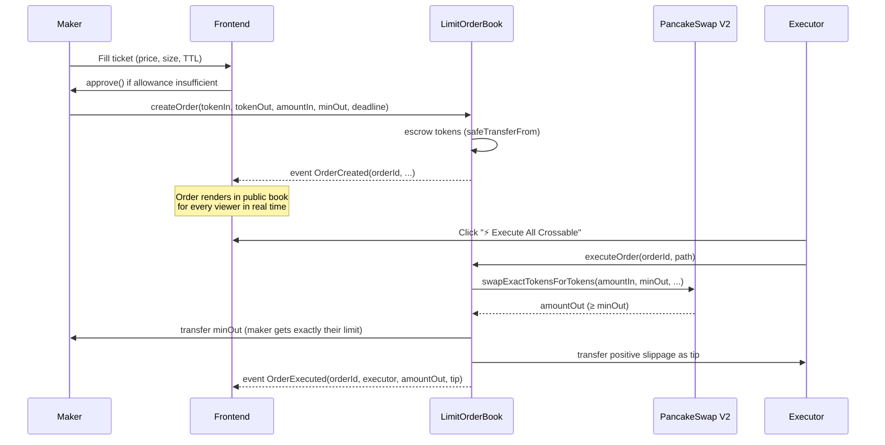
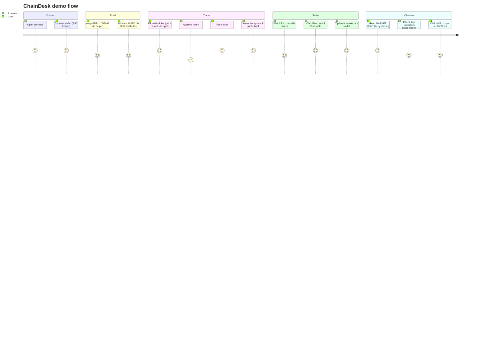

# ChainDesk — Technical

## 1. Architecture

### System overview

ChainDesk is split into three independent surfaces:

- **Contract** (`src/LimitOrderBook.sol`) — the single source of truth. ~200 lines of Solidity. Holds escrow. Executes through PancakeSwap V2. Emits events.
- **Terminal frontend** (`web/`) — a Next.js 14 App Router app. Reads directly from the contract via viem + RPC (no indexer, no backend). Submits user txs through wagmi + RainbowKit.
- **Market Read API route** (`web/app/api/orderbook-read/route.ts`) — a Node serverless route that pulls onchain orderbook state, Binance spot, and Polymarket prediction markets, hands all three to Claude Haiku 4.5, and returns a 3-4 sentence Bloomberg-voice synthesis.

```mermaid
flowchart TB
    subgraph Browser
        UI[ChainDesk Terminal<br/>Next.js + wagmi]
    end
    subgraph Server
        API[/api/orderbook-read<br/>Next.js Route]
    end
    subgraph BSC
        LOB[LimitOrderBook.sol]
        PCS[PancakeSwap V2 Router]
    end
    subgraph External
        BIN[Binance Klines]
        POLY[Polymarket Gamma API]
        CLAUDE[Anthropic API<br/>claude-haiku-4-5]
        RSS[rss2json · Cointelegraph / CoinDesk / Decrypt]
    end

    UI -- eth_call / getLogs --> LOB
    UI -- write tx --> LOB
    LOB -- swapExactTokensForTokens --> PCS
    UI -- fetch every 30s --> API
    API -- getOpenOrdersByPair --> LOB
    API -- spot ref --> BIN
    API -- crypto markets --> POLY
    API -- synthesis --> CLAUDE
    UI -- news headlines --> RSS
```

### Components

| Layer | Tech | Purpose |
|---|---|---|
| Contract | Solidity 0.8.20, Foundry, OpenZeppelin (SafeERC20, ReentrancyGuard) | Escrow + settlement |
| Wallet / chain IO | wagmi 2.12 + viem 2.21 + RainbowKit 2.2 | Connect, sign, broadcast |
| UI | Next.js 14.2 (App Router), React 18, Tailwind | Terminal-style trading UI |
| Charts | lightweight-charts v4 (native) + TradingView embed (optional) | Price + fill overlays |
| Data | React Query 5 against direct RPC calls | No backend, no indexer — pure client reads |
| AI | Anthropic `claude-haiku-4-5-20251001` via `/api/orderbook-read` | Market-read synthesis |
| News | rss2json public proxy | Scrolling crypto news ticker |

### Data flow — placing and executing an order



### On-chain vs off-chain

| Concern | Lives where | Why |
|---|---|---|
| Order state | On-chain (LimitOrderBook storage) | It *is* the orderbook — must be public and tamper-proof |
| Order index per maker / pair | On-chain (`_ordersByMaker`, `_ordersByPair`) | Frontend reads without an indexer |
| Settlement routing | On-chain (PancakeSwap V2 call) | Atomic with the escrow unlock |
| Price reference for UI chart | Off-chain (Binance klines) | Faster, more granular than AMM-derived mid |
| Market Read synthesis | Off-chain (server route → Claude Haiku) | LLM inference can't and shouldn't be on-chain |
| News ticker | Off-chain (rss2json) | Pure flavor, not security-critical |

### Security

| Risk | Mitigation |
|---|---|
| Reentrancy (executeOrder calls external router) | `ReentrancyGuard` on every mutating function + CEI pattern (order.active set false before any external call) |
| Weird-token balance deltas | Output measured by `balanceOf` delta, not router return value |
| Approve hazard on repeated executions | `forceApprove(amountIn)` sets exact allowance per execution |
| Fee-on-transfer tokens | Explicitly unsupported — documented, front-end doesn't list them |
| Executor griefing (wasted gas on uncrossable order) | `InsufficientOutput` reverts the whole tx; executor pays only gas, not tokens |
| Expired orders | `deadline` check in execute; cancel always permitted to maker |
| Admin rug | **No admin keys, no upgradability, no protocol fee.** The contract has only `constructor(router)` privilege, and the router is immutable |

The whole contract is small enough (~200 lines) to read end-to-end in ten minutes. No proxies. No hidden state.

## 2. Setup & Run

### Prerequisites

- Node 18+ and npm (or pnpm)
- [Foundry](https://book.getfoundry.sh/getting-started/installation) — for contract work
- A wallet with BSC Testnet BNB — [faucet](https://www.bnbchain.org/en/testnet-faucet)
- (Optional) An Anthropic API key for live MARKET READ. Without one, the route falls back to a data-driven demo synthesis from real orderbook + spot + Polymarket

### Contract — build, test, deploy

```bash
# From repo root
forge install
forge build
forge test -vv

# Deploy (BSC testnet)
cp .env.example .env          # fill in PRIVATE_KEY, BSC_TESTNET_RPC, BSCSCAN_API_KEY
source .env
forge script script/Deploy.s.sol:Deploy \
    --rpc-url $BSC_TESTNET_RPC \
    --broadcast \
    --private-key $PRIVATE_KEY \
    -vvv
```

Constructor arg: the PancakeSwap V2 router for your target network.
- BSC Testnet: `0xD99D1c33F9fC3444f8101754aBC46c52416550D1`
- BSC Mainnet: `0x10ED43C718714eb63d5aA57B78B54704E256024E`

The currently-deployed instance is recorded in `bsc.address` at the repo root.

### Frontend

```bash
cd web
npm install

# Env
cp .env.local.example .env.local
#   NEXT_PUBLIC_CONTRACT_ADDRESS=0x3B933087c131B30a38fF9C85EE665209b7005751
#   NEXT_PUBLIC_WC_PROJECT_ID=   (optional — WalletConnect)
#   ANTHROPIC_API_KEY=sk-ant-... (optional — powers MARKET READ)

npm run dev
# Open http://localhost:3000
```

The app talks to the contract on BSC testnet by default. Switch networks with `NEXT_PUBLIC_CONTRACT_ADDRESS` + editing `web/lib/constants.ts`.

### Verify it works

- Open http://localhost:3000 — you should see the Bloomberg terminal layout boot with live Binance price flashing in the header and a block number pulsing in the footer.
- Click Connect Wallet, approve a test token, place a small limit order. It should appear instantly in the Order Book Ladder (col 1) and in My Orders (col 2).
- The MARKET READ strip refreshes every 30 seconds. Without an `ANTHROPIC_API_KEY` you still get a real data-driven read; with one, you get the live Claude Haiku synthesis.

## 3. Demo Guide

### Access

- Frontend: run locally (`cd web && npm run dev`) — there is intentionally no hosted URL to avoid any appearance of a token launch during the hackathon window.
- Contract on BscScan: https://testnet.bscscan.com/address/0x3B933087c131B30a38fF9C85EE665209b7005751

### User flow



### Key actions to try

1. **Place an ordinary limit buy** — click any price on the chart to prefill the ticket. Submit.
2. **Watch the book populate** — your order shows up in col 1 with `YOU` pill. Every other browser running the app sees it too.
3. **Execute someone else's order** — when the big amber `⚡ Execute N crossable orders` button appears at the top of the book, click it. Sign in sequence. Tips land in your wallet.
4. **Read the AI synthesis** — the full-width MARKET READ strip under the signals row updates every 30s. It cites actual Polymarket markets by name.
5. **Check the leaderboard** — `Recent Fills` → `Top Executors` tab ranks addresses by cumulative tip value. Every row links to BscScan.

### Expected outcomes

- Order creation: one ERC20 approve + one `createOrder` tx. Tokens leave wallet, land in the contract.
- Order execution: one `executeOrder` tx. `amountOut ≥ minOut` (maker received their limit) and `executorTip = amountOut - minOut` (you pocket the slippage).
- Cancellation: `cancelOrder` refunds the full `amountIn` to the maker.

### Troubleshooting

| Symptom | Likely cause | Fix |
|---|---|---|
| "Wrong network" banner | Wallet on a non-97 chain | Switch to BSC Testnet in MetaMask |
| `InsufficientOutput` on execute | AMM price moved before your tx landed | That's correct behavior — order stayed unfilled, try again |
| MARKET READ shows "read unavailable" | `ANTHROPIC_API_KEY` missing or invalid | Set the key in `web/.env.local` and restart dev server, or rely on the built-in demo fallback |
| Can't see any orders | Contract has no open orders yet | Place one yourself, or use the WrapHelper + GetBusd helpers in col 4 to fund a demo order |
| F-keys don't work on macOS | System reserves them for brightness/volume | Use the letter fallbacks: T (Ticket), B (Book), C (Chart), L (Fills). Both bindings are shown in the status footer |
